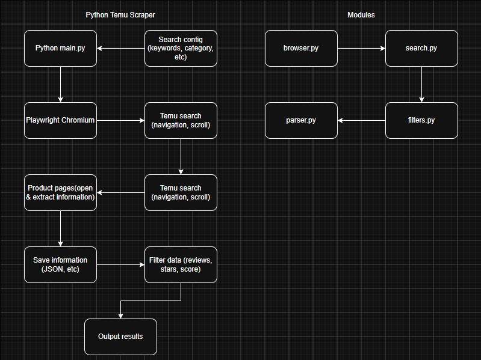

# MusicboxTemuScraper
A product-scraping tool built with **Python** and **Playwright** that helps analyze and compare Temu products efficiently.

The scraper collects product information such as reviews, ratings, and prices, then calculates a score to help identify products that offer the best overall value.

### Project Diagram:
