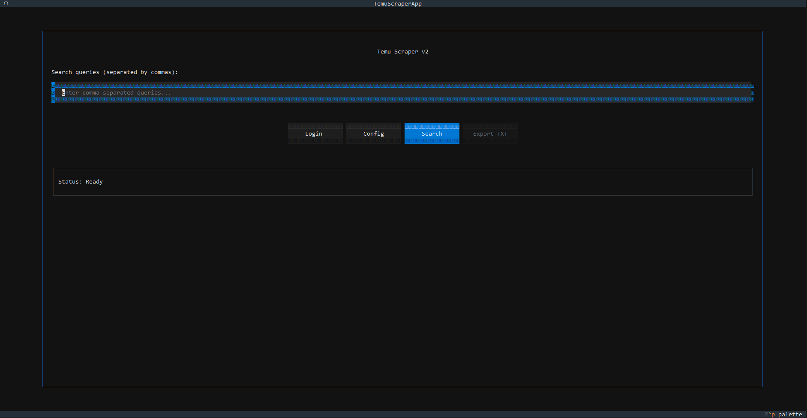

# Temu Scraper v2.0
A product-scraping tool built with **Python**,**Playwright** and **Textual** that helps analyze and compare Temu products efficiently.

The scraper collects product information such as reviews, ratings, and prices, then calculates a score to help identify products that offer the best overall value.

### How to use:
1. Open TemuScraper.exe, press Enter and proceed with the login process. (Click the Login button)
2. After logging into your Temu account, click "Finish Login" (Browser will close automatically)
3. Input your search queries into the textbox and click search (you can tweak the config to your will, but the defaults work well)
4. After your search is completed, you can press the "Export TXT" button and all of the data related to the query will appear in a txt file under the "data" folder

### Project Diagram:

This has been a fun project and learning experience for me, many more to come.
### - 373
